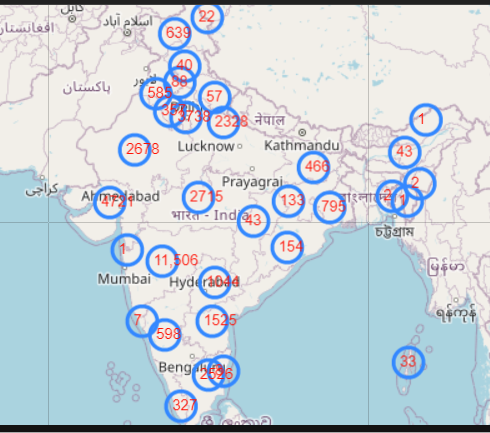
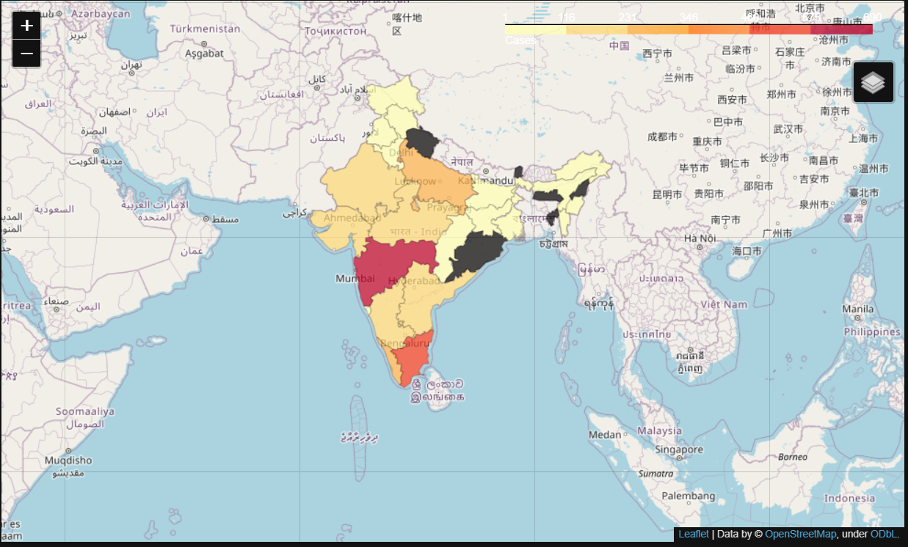

# folium_map

# Folium 

folium builds on the data wrangling strengths of the Python ecosystem and the mapping strengths of the Leaflet.js library. Manipulate your data in Python, then visualize it in a Leaflet map via folium.
 # Concepts
 
 folium makes it easy to visualize data that’s been manipulated in Python on an interactive leaflet map. It enables both the binding of data to a map for choropleth visualizations as well as passing rich vector/raster/HTML visualizations as markers on the map.

The library has a number of built-in tilesets from OpenStreetMap, Mapbox, and Stamen, and supports custom tilesets with Mapbox or Cloudmade API keys. folium supports both Image, Video, GeoJSON and TopoJSON overlays.

## Installation
You can find the installation documentation for the
[Jupyter platform, on ReadTheDocs](https://jupyter.readthedocs.io/en/latest/install.html).
The documentation for advanced usage of Jupyter notebook can be found
[here](https://jupyter-notebook.readthedocs.io/en/latest/).

For a local installation, make sure you have
[pip installed](https://pip.readthedocs.io/en/stable/installing/) and run:

    $ pip install notebook

# description 

I am using data related to corona affected area in india.Folium maps in Jupyter notebook can show visual representation of data.There are two maps in this notbook

# 1 Markers 

# 2 Choropleth

# Steps:
download all the resourses of this assignment

# Special Thanks:

Shraddha Bidaye who, maintain csv file.

### License

